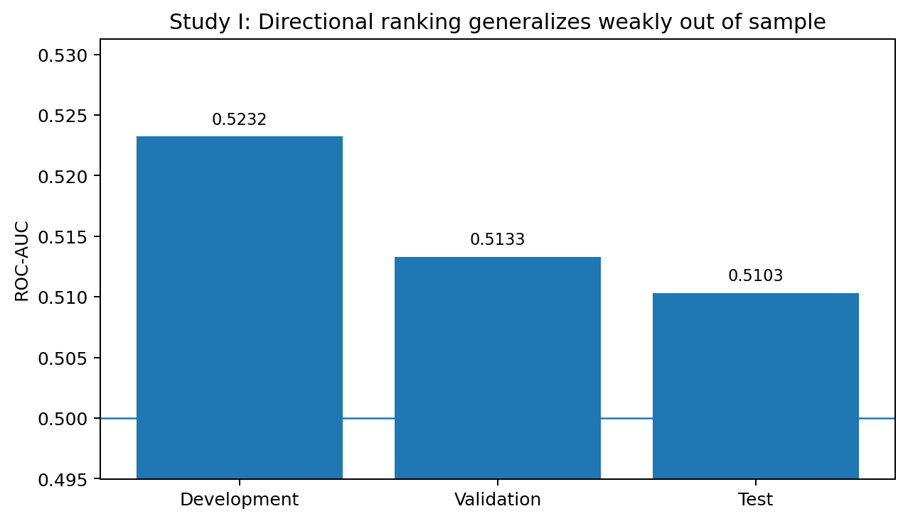
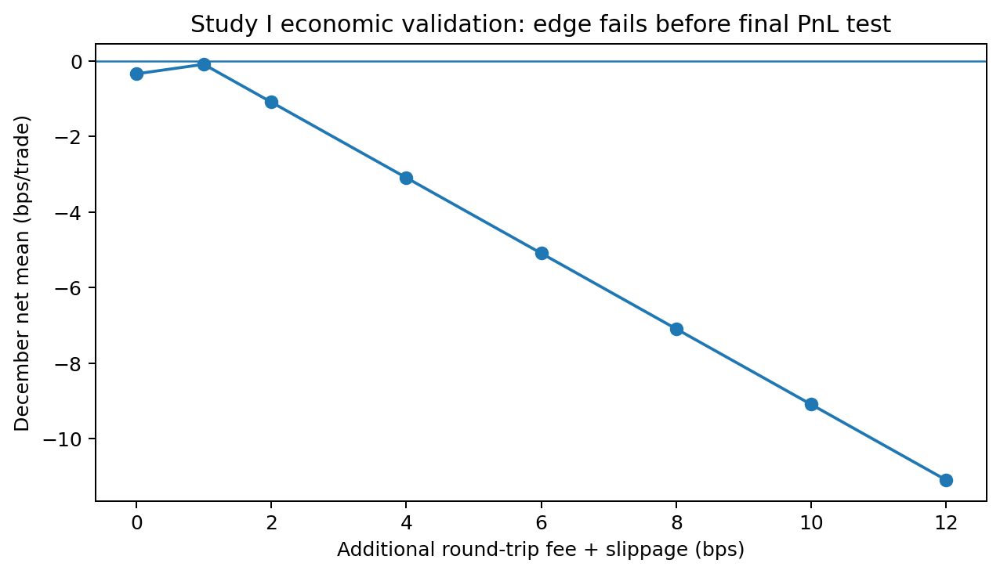
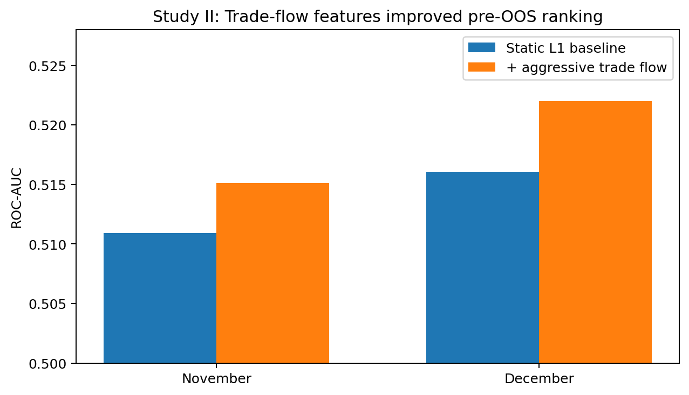
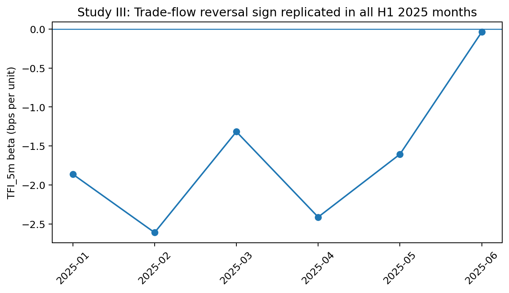

# Microstructure Signals vs Executable Alpha

**A three-study quantitative-research case on BTCUSDT perpetual futures**

This repository studies a question that is easy to state and difficult to answer honestly:

> **Can short-horizon market-microstructure predictability survive out-of-sample testing and realistic execution constraints?**

The project deliberately treats **statistical predictability, predictive generalization, and executable alpha as separate claims**.

## Results at a glance

| Stage | Result | Interpretation |
|---|---:|---|
| Static L1 imbalance, development | 10m beta **+0.5255 bps/unit** | Robust positive association |
| Static L1 imbalance, validation | 10m beta **+0.6647 bps/unit** | Stable pre-test effect |
| Logistic model, untouched Jan-Mar 2024 | **AUC 0.5103** | Weak ranking information generalized |
| Conservative economic validation | **Failed at every cost scenario** | Statistical signal was not executable under the frozen taker design |
| + aggressive trade flow, Nov 2023 | **Delta AUC +0.0042** | Incremental information appeared |
| + aggressive trade flow, Dec 2023 | **Delta AUC +0.0060** | Incremental improvement replicated pre-OOS |
| TFI sign hypothesis | **Rejected** | Aggressive flow behaved as a reversal, not continuation signal |
| Fresh 2025 reversal confirmation | **AUC 0.5210** | Reversal replicated |
| Fresh 2025 reversal replication | **AUC 0.5151** | Reversal replicated again |
| Incremental vs simple price reversal | **Not robust** | Final Jul-Dec 2025 OOS remained closed |

## The research sequence

### Study I - Static top-of-book state

I tested whether top-of-book imbalance predicts exact-horizon future **mid-price** returns.

Methodological controls included:

- exact clock-time targets on a complete minute grid;
- HAC/Newey-West inference for overlapping returns;
- Benjamini-Hochberg FDR;
- all-offset non-overlapping checks;
- moving-block bootstrap;
- chronological development / validation / test periods;
- a locked test set;
- linear/logistic baselines before nonlinear ML.

The 10-minute close-imbalance coefficient stayed positive across all pre-test months. The validation gate passed, and the untouched Jan-Mar 2024 model test produced **AUC 0.5103**.

That is evidence of weak directional information - **not evidence of tradable alpha**.



### Study I-B - Economic validation

The model was frozen. Threshold selection used November 2023, confirmation used December, and any Jan-Mar economic PnL was gated.

Execution assumptions were conservative:

- signal from completed minute `t`;
- entry at reconstructed BBO at `t+1`;
- exit at original `t+10` endpoint;
- spread crossed on both sides;
- non-overlapping positions;
- additional round-trip cost sensitivity from 0 to 12 bps.

Every cost scenario failed the December economic gate. Even at **0 additional bps**, the selected December strategy averaged **-0.343 bps/trade**. The high-confidence threshold had gross break-even additional cost of only **0.909 bps**.

The final economic OOS PnL was therefore **not opened**.



### Study II - Dynamic aggressive trade flow

I added a new information source rather than tuning the failed backtest.

Using Binance USD-M 1-minute klines:

`TFI = (2 * taker_buy_volume - total_volume) / total_volume`

The augmented logistic model improved ranking in both pre-OOS periods:

- November: **Delta AUC +0.0042**
- December: **Delta AUC +0.0060**

But the pre-registered continuation hypothesis was rejected. TFI coefficients were **negative in every May-Dec 2023 month**: aggressive buying pressure behaved more like a short-horizon reversal signal.

Because the sign gate failed, Jan-Mar flow-enhanced OOS remained closed.



### Study III - Fresh 2025 reversal replication

The unexpected reversal pattern was converted into a new hypothesis and tested on a completely newer sample: **calendar 2025 Binance USD-M 1-minute klines**.

Results:

- Jan-Mar confirmation: TFI beta **-1.9028 bps/unit**, HAC `p=0.00003`, reversal AUC **0.5210**
- Apr-Jun replication: TFI beta **-1.2810 bps/unit**, HAC `p=0.00014`, reversal AUC **0.5151**
- monthly sign: **6/6 negative**

However, after controlling for simple 5-minute price reversal, the Apr-Jun TFI coefficient was no longer strong enough (`p=0.2244`), and the reversal AUC exceeded price-reversal AUC by only **+0.0008**, below the pre-registered gate.

Therefore **Jul-Dec 2025 remained closed**.



## Central conclusion

> **A feature can contain statistically reproducible information without establishing executable alpha.**

This project found two persistent microstructure relationships:

1. positive static book imbalance was associated with positive future returns;
2. positive aggressive trade-flow imbalance was associated with subsequent reversal.

But the static-book model did not survive conservative economic validation, and the fresh trade-flow reversal signal was not demonstrably incremental to simple short-horizon price mean reversion.

That distinction is the main research result.

## Repository structure

```text
.
├── README.md
├── report/
│   └── Microstructure_Alpha_Research_Report.pdf
├── figures/
├── docs/
│   ├── recruiter_summary.md
│   ├── cv_bullets.md
│   ├── interview_defense.md
│   ├── reproducibility.md
│   └── protocols/
├── results/
│   ├── study1_static_book/
│   ├── study1_economic_validation/
│   ├── study2_trade_flow/
│   └── study3_2025_replication/
├── src/microalpha/
├── scripts/
└── tests/
```

Raw market data are intentionally excluded from Git.

## Reproduce the code checks

```bash
python -m venv .venv
# Windows: .venv\Scripts\activate
# macOS/Linux: source .venv/bin/activate

pip install -r requirements.txt
pip install -e .
pytest -q
```

The final release preserves the original pre-registration scripts and gates used during the research sequence.

## Why there is no XGBoost result

Nonlinear ML was intentionally not used as a post-hoc rescue after the economic and incremental gates failed.

A more complicated model would be justified only by a new pre-registered study on genuinely new data. That choice is part of the portfolio: **model restraint is evidence of research judgment**.

## Limitations

- single crypto instrument and venue;
- one-minute aggregation for most studies;
- limited representation of queue dynamics;
- the economic backtest is a conservative small-notional research simulator, not a production execution engine;
- funding, market impact, capacity, outages and sub-minute latency are not fully modeled;
- Study III uses close-to-close returns because later reliable bookTicker coverage was unavailable;
- small AUC improvements are statistically and economically different claims.

## References

- Cont, Kukanov & Stoikov, *The Price Impact of Order Book Events*.
- Cont, Cucuringu & Zhang, *Cross-Impact of Order Flow Imbalance in Equity Markets*.
- Binance Public Data documentation for USD-M futures klines, trades, archive checksums and downloadable market data.

See `docs/references.md` and the full report for details.
